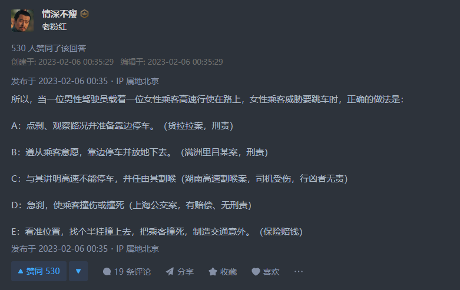
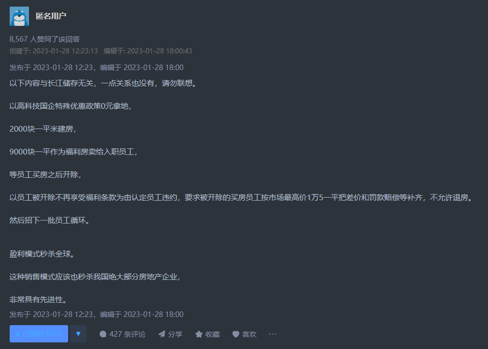
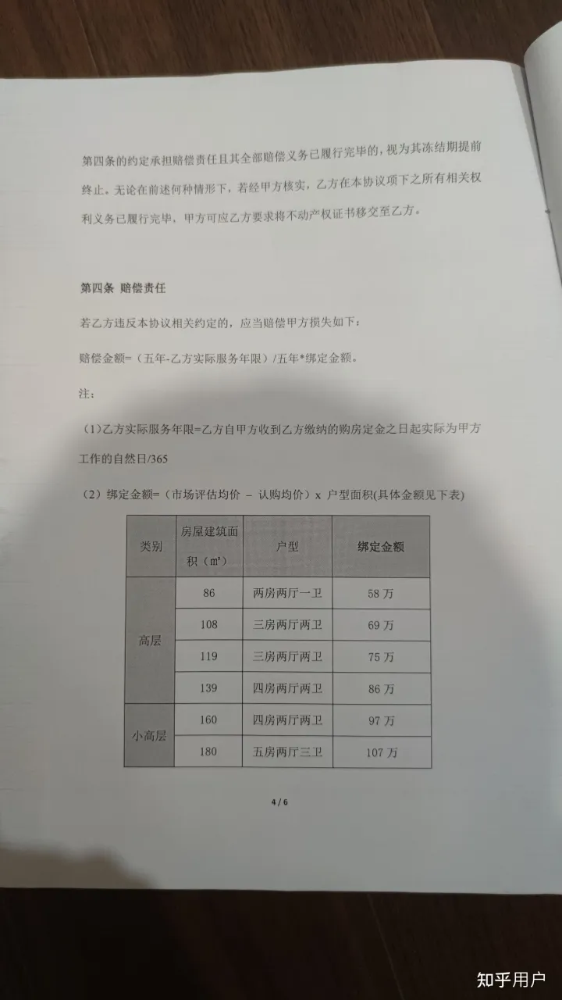

# 2023年低血压治疗笔记

## 1月份：

* 5号：

  * 奥密克戎(omicron)XBB变种传播效率变高，专家声称不用担心二次感染，也不用担心XBB对肠道的影响，因为不管是不是XBB都会对肠道造成影响。
  * 蒙脱石散上热搜

* 8号：

  * 索尼涉嫌乳化，涉及邱少云烈士。同时加多宝、金山毒霸等品牌也被牵连涉及相关性质的乳化。\
    * 是否乳化是否敏感，建议民族自信，而不是无能狂怒。

* 11号：
  * [媒体称「太阳 4 天内发出两次 X 级耀斑，几天后将指向地球，或引发强烈地磁暴」，这将会有什么影响？](https://tophub.today/l?e=20290acejdfNw60cNd9SbojlAp7A6KapCjJqczROlSyJX%2BaJkHFs2LZDLyI6QfwcM59Oeepcxzb1%2FHjJ7kLi1NtHLEim7PyEJZXZud8eQTJoYxG724Z6Ek4jlkTtLtn0J9noOvQZ7LRE6O8I92E)

* 15号：
  * 大年初一《流浪地球》首日票房大胜，随后《满江红》排片反超，在微博上吵的很凶。
    * 有相关证据发现水军根据“流量”词组进行统一黑评。
    * 《流浪地球》首日票房远超《满江红》，但次日排片反而降低，最后与《满江红》票房差距过大。
    * 传闻学校组织学生统一观看《满江红》
    * 欢喜传媒与张艺谋的合约被扒，可分析出相关雇佣水军的动机。

  ## 2月份

* 3日

  * 华为问界撞车气囊未弹出，受害者领导打电话让受害者“给个面子”。

* 4日

  * 苹果财报业绩不佳，iPhone 14 Pro全系降价700元。
    * 官网不降价。

* 5日

  * 妻子置气想吃火锅跳车死亡，丈夫司机被判2年有期徒刑，缓刑3年。
    * 王强因过于自信的过失致一人死亡，其行为因“过于自信”已构成过失致人死亡罪。
    * 以“普信”制“自信”
    * 
  
  * 长江存储1月份集中裁员，并要求员工加价赔偿房产，杠杆玩的溜。
    * 
    * 
